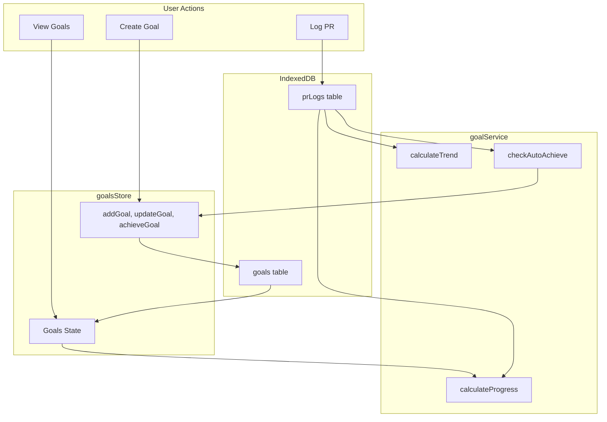

# Goal Setting & Tracking - Feature Specification

## Feature Analysis

### Core Value Proposition

Enable athletes to set measurable PR goals with deadlines and track progress, creating motivation through visible advancement and accountability.

### Key User Flows

1. **Set Goal**: User selects item → sets target value → picks deadline
2. **Track Progress**: User views goals → sees percentage complete → understands time remaining
3. **Achieve Goal**: New PR logged → system auto-detects achievement → celebrates
4. **Manage Goals**: Edit target/date, mark achieved, cancel stale goals

---

## UI/UX Best Practices Applied

### Mobile-First Patterns

- **Progressive Disclosure**: Expandable goal cards (tap to see details)
- **Thumb-Friendly Actions**: FAB for add, swipe actions for edit/delete
- **Scannable Layout**: Progress bars provide at-a-glance status

### Visual Hierarchy

- Active goals prominent, achieved goals collapsed
- Color-coded trend indicators (green=ahead, yellow=on track, red=behind)
- Progress bars with percentage labels

### Accessibility

- ARIA labels on all interactive elements
- Keyboard navigation support
- Color-blind friendly status indicators (icons + colors)

---

## Wireframe Diagrams

### Goals List Page (`/goals`)

```
┌─────────────────────────────────┐
│  ← Goals                    ⚙️  │  Header
├─────────────────────────────────┤
│                                 │
│  ┌─────────────────────────┐   │
│  │ 🎯 Active Goals (3)     │   │  Section Header
│  └─────────────────────────┘   │
│                                 │
│  ┌─────────────────────────┐   │
│  │ Back Squat              │   │  Goal Card
│  │ 275 lb → 300 lb         │   │  Current → Target
│  │ ████████░░░░ 92%        │   │  Progress Bar
│  │ 23 days left  🟢 Ahead  │   │  Time + Trend
│  └─────────────────────────┘   │
│                                 │
│  ┌─────────────────────────┐   │
│  │ Fran                    │   │
│  │ 4:30 → 3:45             │   │
│  │ ██████░░░░░░ 65%        │   │
│  │ 45 days left  🟡 Track  │   │
│  └─────────────────────────┘   │
│                                 │
│  ┌─────────────────────────┐   │
│  │ ✓ Achieved Goals (2)  ▼ │   │  Collapsed Section
│  └─────────────────────────┘   │
│                                 │
│                          (+)   │  FAB
└─────────────────────────────────┘
```

### Expanded Goal Card

```
┌─────────────────────────────────┐
│ Back Squat                  ⋮  │  Overflow menu
│ 275 lb → 300 lb                │
│ ████████████░░ 92%             │
│ 23 days left        🟢 Ahead   │
├─────────────────────────────────┤
│ Recent PRs:                    │
│  • 275 lb - Jan 15, 2026       │
│  • 265 lb - Dec 28, 2025       │
│  • 255 lb - Dec 10, 2025       │
├─────────────────────────────────┤
│ Projected: Feb 5, 2026         │
│ (8 days ahead of schedule)     │
├─────────────────────────────────┤
│ [Mark Achieved]  [Edit]        │
└─────────────────────────────────┘
```

### Add/Edit Goal Modal

```
┌─────────────────────────────────┐
│  ×        Set Goal              │
├─────────────────────────────────┤
│                                 │
│  Select Item                   │
│  ┌─────────────────────────┐   │
│  │ 🔍 Search items...      │   │  Searchable dropdown
│  └─────────────────────────┘   │
│                                 │
│  Target Value                  │
│  ┌─────────────────────────┐   │
│  │ 300              lb  ▼ │   │  Value + unit
│  └─────────────────────────┘   │
│  Current best: 275 lb          │  Helper text
│                                 │
│  Target Date                   │
│  ┌─────────────────────────┐   │
│  │ 📅 Mar 15, 2026         │   │  Date picker
│  └─────────────────────────┘   │
│                                 │
│  ── Advanced (optional) ──    │  Collapsible
│                                 │
│  Variant    [Rx ▼]             │
│  Reps       [1RM ▼]            │
│                                 │
│  ┌─────────────────────────┐   │
│  │       Save Goal         │   │  Primary button
│  └─────────────────────────┘   │
└─────────────────────────────────┘
```

### ItemDetail Integration

```
┌─────────────────────────────────┐
│  ← Back Squat            ★  ⋮  │
├─────────────────────────────────┤
│                                 │
│  ┌─────────────────────────┐   │
│  │  🏆 Personal Record     │   │
│  │                         │   │
│  │     275 lb              │   │
│  │     Jan 15, 2026        │   │
│  │                         │   │
│  │  ▓▓▓▓▓▓▓▓░░ 92%        │   │  Goal progress
│  │  Goal: 300 lb           │   │
│  └─────────────────────────┘   │
│                                 │
│  [ Set Goal ] (if no goal)     │
│                                 │
│  PR History...                 │
└─────────────────────────────────┘
```

---

## Component Architecture

```
src/
├── pages/
│   └── Goals.tsx              # Main goals page
├── components/
│   └── goals/
│       ├── GoalCard.tsx       # Individual goal display
│       ├── GoalProgress.tsx   # Progress bar + percentage
│       ├── GoalModal.tsx      # Add/Edit modal
│       ├── TrendIndicator.tsx # Ahead/On Track/Behind
│       └── ItemSelector.tsx   # Searchable item dropdown
├── stores/
│   └── goalsStore.ts          # Zustand store for goals
├── services/
│   └── goalService.ts         # Progress calculations, projections
└── types/
    └── goal.ts                # Goal interface
```

---

## Data Flow



---

## Task Breakdown

### Phase 1: Foundation (Database + Store)

1. Add `Goal` type to `src/types/goal.ts`
2. Update IndexedDB schema with `goals` table
3. Create `goalsStore.ts` with CRUD actions
4. Create `goalService.ts` with progress/trend calculations

### Phase 2: Core UI Components

5. Create `GoalProgress.tsx` component (progress bar)
6. Create `TrendIndicator.tsx` component
7. Create `ItemSelector.tsx` (searchable dropdown)
8. Create `GoalCard.tsx` component

### Phase 3: Goals Page

9. Create `Goals.tsx` page with active/achieved sections
10. Create `GoalModal.tsx` for add/edit
11. Add route to `/goals` in router
12. Add navigation link

### Phase 4: Integration

13. Integrate goal display into `ItemDetail.tsx`
14. Add "Set Goal" button to ItemDetail
15. Implement auto-achieve on PR log
16. Add goal quick-view to Home page

### Phase 5: Polish

17. Add empty states and loading states
18. Add confirmation dialogs for delete/cancel
19. Test responsive design
20. Accessibility audit

---

## Technical Considerations

### Progress Calculation

- **Load/Reps (higher is better)**: `(currentPR / targetValue) * 100`
- **Time (lower is better)**: `(targetValue / currentPR) * 100`
- Cap at 100% until officially achieved

### Trend Projection

- Linear regression on last 3-5 PRs
- Project when target will be reached at current rate
- Compare projected date vs target date

### Auto-Achievement

- Hook into `addPRLog` action in catalogStore
- Check if new PR meets/exceeds goal target
- Prompt user to mark as achieved (don't auto-complete)

### Reusable Components

- `GoalProgress.tsx` can be used in ItemDetail
- `ItemSelector.tsx` can be reused for WOD Generator
- `TrendIndicator.tsx` can be used in Progress Charts